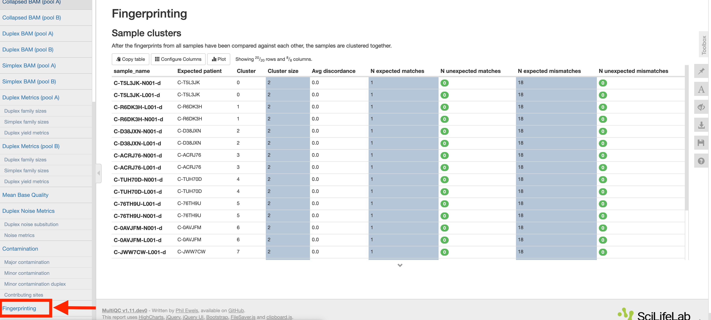

### Introduction

Two metrics are used to estimate sample contamination: minor contamination and major contamination. Moreover, minor contamination is calculated separately for collapsed and duplex BAMs. Both contamination metrics are produced by the `fingerprinting` SNP set. However, minor contamination is calculated using just the homozygous sites, whereas the major contamination is via the ratio fo heterozygous to homozygous sites. For each contamination-BAM type combination there is a table showing per-sample contamination values and any associated metrics.

### Methods
**Tool used:** [biometrics](https://github.com/msk-access/biometrics) 
**BAM type:** (1) collapsed BAM and (2) duplex BAM 
**Regions:** MSK-ACCESS-v1_0-curatedSNPs.vcf

It is a two step process to produce the table: (1) extract SNP genotypes from each sample using `biometrics extract` command and (2) perform a pairwise comparison of all samples to determine sample relatedness using the `biometrics minor` and `biometrics major` commands. Please see the biometrics documentation for further documentation on the methods.

### Interpretation

#### Minor contamination
Samples with minor contamination rates of >0.002 are considered contamination.

#### Major contamination
The fraction of heterozygous positions should be around 0.5. If the fraction is greater than 0.6, it is considered to have major contamination.
