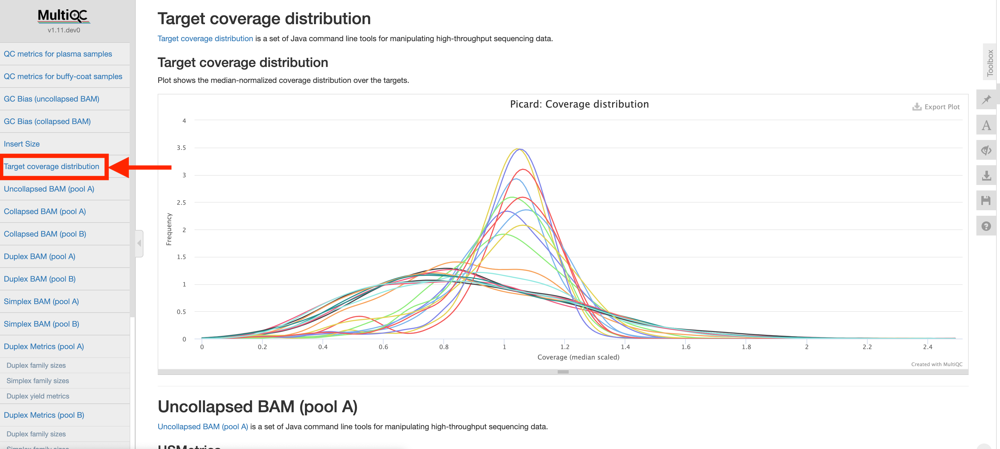

# Target coverage distribution

## Introduction

This figure shows the density plot of coverage values from the ACCESS target regions. Each line is data from one sample. Each sample is normalized by the median coverage value of that sample to align all peaks with one another and correct for sample-level differences.

## Methods

**Tool used:** [GATK-CollectHsMetrics](https://gatk.broadinstitute.org/hc/en-us/articles/360036856051-CollectHsMetrics-Picard-)\
&#x20;**BAM type:** Collapsed BAM\
&#x20;**Regions:** Pool A

The data used to produce this figure are the values under the `normalized_coverage` column, which are in the `*_per_target_coverage.txt` output file from CollectHsMetrics. Then the `gaussian_kde` function from the python scipy package is used to produce the density plot.

## Interpretation

Each distribution should be unimodal, apart from a second peak on the low end due to X chromosome mapping from male samples. Narrow peaks are indicative of evenly distributed coverage across all bait regions. Wider distributions indicate uneven read distribution, and may be correlated with a large GC bias. Note that the provided bed file lists start and stop coordinates of ACCESS design probes, not the actual genomic target regions.
